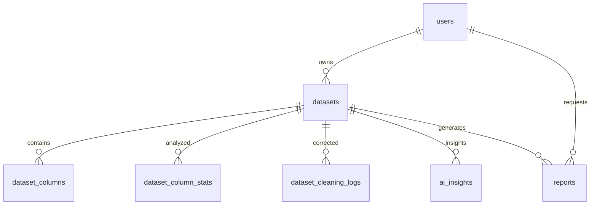

# Modèles de Données - Varlor Backend

## Vue d'Ensemble

Le backend de Varlor utilise PostgreSQL comme base de données principale avec Lucid ORM comme couche d'abstraction. Le schéma est conçu pour supporter le multi-tenancy, la traçabilité complète et les performances à grande échelle.

## Structure des Tables

### 1. Users

Gestion des utilisateurs avec isolation par tenant.

```sql
CREATE TABLE users (
  id SERIAL PRIMARY KEY,
  email VARCHAR(255) UNIQUE NOT NULL,
  password_hash VARCHAR(255) NOT NULL,
  role VARCHAR(50) DEFAULT 'admin',
  tenant_id VARCHAR(255) NOT NULL,
  created_at TIMESTAMP WITH TIME ZONE DEFAULT NOW(),
  updated_at TIMESTAMP WITH TIME ZONE DEFAULT NOW(),
  last_login_at TIMESTAMP WITH TIME ZONE,
  failed_login_attempts INTEGER DEFAULT 0,
  locked_until TIMESTAMP WITH TIME ZONE
);

-- Indexes
CREATE INDEX idx_users_email ON users(email);
CREATE INDEX idx_users_tenant_id ON users(tenant_id);
CREATE INDEX idx_users_role ON users(role);
```

**Champs:**
- `id`: Identifiant unique
- `email`: Email unique (login)
- `password_hash`: Mot de passe hashé avec scrypt
- `role`: Rôle utilisateur (admin, user, etc.)
- `tenant_id`: Identifiant du tenant pour isolation
- `last_login_at`: Dernière connexion
- `failed_login_attempts`: Tentatives de connexion échouées
- `locked_until`: Date de fin de verrouillage

### 2. Datasets

Métadonnées des datasets uploadés.

```sql
CREATE TABLE datasets (
  id SERIAL PRIMARY KEY,
  tenant_id VARCHAR(255) NOT NULL,
  user_id INTEGER NOT NULL REFERENCES users(id),
  name VARCHAR(255) NOT NULL,
  description TEXT,
  file_name VARCHAR(255) NOT NULL,
  file_size BIGINT NOT NULL,
  file_format dataset_file_format NOT NULL,
  storage_path VARCHAR(500) NOT NULL,
  storage_backend VARCHAR(50) DEFAULT 'local',

  -- Processing metadata
  row_count INTEGER,
  column_count INTEGER,
  processing_time_ms INTEGER,

  -- Status tracking
  status dataset_status DEFAULT 'UPLOADING',
  cleaning_status cleaning_status DEFAULT 'pending',
  analysis_status analysis_status DEFAULT 'pending',
  ai_insights_status ai_status DEFAULT 'pending',

  -- Quality metrics
  quality_score DECIMAL(5,4),
  corrections_applied INTEGER DEFAULT 0,
  duplicate_rows INTEGER DEFAULT 0,

  -- Error handling
  error_message TEXT,
  cleaning_error TEXT,
  analysis_error TEXT,
  ai_insights_error TEXT,

  -- Timestamps
  uploaded_at TIMESTAMP WITH TIME ZONE DEFAULT NOW(),
  processed_at TIMESTAMP WITH TIME ZONE,
  cleaning_completed_at TIMESTAMP WITH TIME ZONE,
  analysis_completed_at TIMESTAMP WITH TIME ZONE,
  ai_insights_generated_at TIMESTAMP WITH TIME ZONE,
  created_at TIMESTAMP WITH TIME ZONE DEFAULT NOW(),
  updated_at TIMESTAMP WITH TIME ZONE DEFAULT NOW()
);

-- Enums
CREATE TYPE dataset_file_format AS ENUM ('CSV', 'EXCEL');
CREATE TYPE dataset_status AS ENUM (
  'UPLOADING', 'PARSING', 'CLEANING', 'ANALYZING', 'READY', 'FAILED'
);
CREATE TYPE cleaning_status AS ENUM (
  'pending', 'processing', 'completed', 'failed'
);
CREATE TYPE analysis_status AS ENUM (
  'pending', 'processing', 'completed', 'failed'
);
CREATE TYPE ai_status AS ENUM (
  'pending', 'processing', 'completed', 'failed'
);

-- Indexes
CREATE INDEX idx_datasets_tenant_user ON datasets(tenant_id, user_id);
CREATE INDEX idx_datasets_status ON datasets(status);
CREATE INDEX idx_datasets_user ON datasets(user_id);
CREATE INDEX idx_datasets_created ON datasets(created_at);
```

**Champs:**
- `id`: Identifiant unique
- `tenant_id`: Isolation multi-tenant
- `user_id`: Propriétaire du dataset
- `name`: Nom du dataset
- `file_format`: Format du fichier (CSV/EXCEL)
- `storage_path`: Chemin de stockage
- `status`: Statut global du dataset
- `cleaning_status`: Statut du nettoyage
- `analysis_status`: Statut de l'analyse
- `quality_score`: Score de qualité (0-1)
- `corrections_applied`: Nombre de corrections appliquées

### 3. Dataset Columns

Structure et métadonnées des colonnes.

```sql
CREATE TABLE dataset_columns (
  id SERIAL PRIMARY KEY,
  dataset_id INTEGER NOT NULL REFERENCES datasets(id) ON DELETE CASCADE,
  column_name VARCHAR(255) NOT NULL,
  column_index INTEGER NOT NULL,
  detected_type column_type NOT NULL,

  -- Sample data for validation
  sample_values JSONB,
  unique_values JSONB,

  -- Quality metrics
  total_count INTEGER NOT NULL,
  missing_count INTEGER DEFAULT 0,
  missing_percentage DECIMAL(5,2) DEFAULT 0,
  invalid_count INTEGER DEFAULT 0,
  invalid_percentage DECIMAL(5,2) DEFAULT 0,
  duplicate_count INTEGER DEFAULT 0,

  -- Data characteristics
  min_length INTEGER,
  max_length INTEGER,
  avg_length DECIMAL(10,2),

  -- Quality percentage
  quality_percentage DECIMAL(5,2) NOT NULL,

  created_at TIMESTAMP WITH TIME ZONE DEFAULT NOW(),
  updated_at TIMESTAMP WITH TIME ZONE DEFAULT NOW()
);

-- Enums
CREATE TYPE column_type AS ENUM (
  'TEXT', 'NUMBER', 'INTEGER', 'FLOAT',
  'DATE', 'DATETIME', 'BOOLEAN', 'UNKNOWN'
);

-- Indexes
CREATE UNIQUE INDEX idx_dataset_columns_unique ON dataset_columns(dataset_id, column_name);
CREATE INDEX idx_dataset_columns_dataset ON dataset_columns(dataset_id);
CREATE INDEX idx_dataset_columns_type ON dataset_columns(detected_type);
```

**Champs:**
- `column_name`: Nom de la colonne
- `detected_type`: Type détecté automatiquement
- `sample_values`: Échantillon de valeurs pour validation
- `missing_count`: Nombre de valeurs manquantes
- `invalid_count`: Nombre de valeurs invalides
- `quality_percentage`: Pourcentage de qualité

### 4. Dataset Column Stats

Statistiques détaillées par colonne.

```sql
CREATE TABLE dataset_column_stats (
  id SERIAL PRIMARY KEY,
  dataset_id INTEGER NOT NULL REFERENCES datasets(id) ON DELETE CASCADE,
  column_name VARCHAR(255) NOT NULL,
  detected_type column_type NOT NULL,

  -- Statistics based on type
  -- For numeric columns
  stats_json JSONB,

  -- Outlier detection
  outlier_count INTEGER DEFAULT 0,
  outliers_json JSONB,

  -- Chart data
  chart_data_json JSONB,

  -- Time series data (if date/time column)
  time_curve_json JSONB,

  created_at TIMESTAMP WITH TIME ZONE DEFAULT NOW(),
  updated_at TIMESTAMP WITH TIME ZONE DEFAULT NOW()
);

-- Indexes
CREATE INDEX idx_dataset_stats_dataset_col ON dataset_column_stats(dataset_id, column_name);
CREATE INDEX idx_dataset_stats_type ON dataset_column_stats(detected_type);
CREATE GIN INDEX idx_dataset_stats_json ON dataset_column_stats USING GIN(stats_json);
```

**Structure de `stats_json` par type:**

**Type NUMBER/FLOAT:**
```json
{
  "count": 1000,
  "mean": 45.5,
  "median": 44.0,
  "mode": 42.0,
  "stdDev": 15.2,
  "variance": 231.04,
  "min": 5.0,
  "max": 95.0,
  "q1": 32.0,
  "q3": 58.0,
  "iqr": 26.0,
  "skewness": 0.12,
  "kurtosis": -0.45,
  "sum": 45500.0,
  "zeros": 15,
  "negatives": 5
}
```

**Type INTEGER:**
```json
{
  "count": 1000,
  "mean": 45.5,
  "median": 44,
  "mode": 42,
  "stdDev": 15.2,
  "min": 5,
  "max": 95,
  "range": 90,
  "sum": 45500
}
```

**Type TEXT:**
```json
{
  "count": 1000,
  "uniqueCount": 850,
  "avgLength": 12.5,
  "minLength": 3,
  "maxLength": 50,
  "mostCommon": ["Paris", "Lyon", "Marseille"],
  "patterns": [
    {"pattern": "^[A-Z][a-z]+$", "count": 700},
    {"pattern": "^\\d{5}$", "count": 200}
  ],
  "emptyCount": 50,
  "whitespaceCount": 25
}
```

**Type DATE:**
```json
{
  "count": 1000,
  "minDate": "2020-01-01",
  "maxDate": "2025-01-01",
  "dateRange": "5 years",
  "mostCommonYear": 2023,
  "mostCommonMonth": 6,
  "weekendCount": 280,
  "holidayCount": 50,
  "invalidDates": 5
}
```

### 5. Dataset Cleaning Logs

Historique détaillé des corrections appliquées.

```sql
CREATE TABLE dataset_cleaning_logs (
  id SERIAL PRIMARY KEY,
  dataset_id INTEGER NOT NULL REFERENCES datasets(id) ON DELETE CASCADE,
  column_name VARCHAR(255) NOT NULL,
  row_index BIGINT,

  -- Issue details
  issue_type cleaning_issue_type NOT NULL,
  issue_severity cleaning_severity NOT NULL DEFAULT 'MEDIUM',

  -- Values
  original_value TEXT,
  corrected_value TEXT,

  -- Correction details
  correction_rule VARCHAR(255),
  correction_confidence DECIMAL(3,2), -- 0-1

  -- Metadata
  batch_id UUID, -- Pour regrouper les corrections
  auto_applied BOOLEAN DEFAULT true,
  requires_review BOOLEAN DEFAULT false,

  created_at TIMESTAMP WITH TIME ZONE DEFAULT NOW()
);

-- Enums
CREATE TYPE cleaning_issue_type AS ENUM (
  'MISSING_VALUE', 'INVALID_FORMAT', 'OUTLIER',
  'DUPLICATE', 'INCONSISTENT_CATEGORICAL', 'TYPE_MISMATCH'
);
CREATE TYPE cleaning_severity AS ENUM ('LOW', 'MEDIUM', 'HIGH', 'CRITICAL');

-- Indexes
CREATE INDEX idx_cleaning_logs_dataset ON dataset_cleaning_logs(dataset_id);
CREATE INDEX idx_cleaning_logs_column ON dataset_cleaning_logs(column_name);
CREATE INDEX idx_cleaning_logs_type ON dataset_cleaning_logs(issue_type);
CREATE INDEX idx_cleaning_logs_severity ON dataset_cleaning_logs(issue_severity);
CREATE INDEX idx_cleaning_logs_review ON dataset_cleaning_logs(requires_review);
```

**Champs:**
- `issue_type`: Type de problème détecté
- `original_value`: Valeur originale
- `corrected_value`: Valeur corrigée
- `correction_rule`: Règle appliquée
- `auto_applied`: Correction automatique
- `requires_review`: Nécessite revue manuelle

### 6. AI Insights

Stockage des insights générés par l'IA.

```sql
CREATE TABLE ai_insights (
  id SERIAL PRIMARY KEY,
  dataset_id INTEGER NOT NULL REFERENCES datasets(id) ON DELETE CASCADE,

  -- Insight content
  category VARCHAR(100) NOT NULL,
  title VARCHAR(255) NOT NULL,
  description TEXT NOT NULL,
  severity insight_severity NOT NULL DEFAULT 'MEDIUM',
  recommendation TEXT,

  -- Metadata
  confidence_score DECIMAL(3,2),
  related_columns TEXT[],
  suggested_visualizations JSONB,

  -- AI metadata
  model_version VARCHAR(50),
  generation_prompt TEXT,
  tokens_used INTEGER,

  created_at TIMESTAMP WITH TIME ZONE DEFAULT NOW(),
  updated_at TIMESTAMP WITH TIME ZONE DEFAULT NOW()
);

-- Enums
CREATE TYPE insight_severity AS ENUM ('LOW', 'MEDIUM', 'HIGH', 'CRITICAL');

-- Indexes
CREATE INDEX idx_ai_insights_dataset ON ai_insights(dataset_id);
CREATE INDEX idx_ai_insights_category ON ai_insights(category);
CREATE INDEX idx_ai_insights_severity ON ai_insights(severity);
```

### 7. Reports

Métadonnées des rapports générés.

```sql
CREATE TABLE reports (
  id SERIAL PRIMARY KEY,
  dataset_id INTEGER NOT NULL REFERENCES datasets(id) ON DELETE CASCADE,
  user_id INTEGER NOT NULL REFERENCES users(id),

  -- Report metadata
  report_type VARCHAR(50) NOT NULL DEFAULT 'standard',
  template VARCHAR(50) DEFAULT 'default',
  title VARCHAR(255) NOT NULL,

  -- Content
  file_path VARCHAR(500),
  file_size BIGINT,
  page_count INTEGER,

  -- Generation metadata
  status report_status DEFAULT 'generating',
  generation_time_ms INTEGER,
  error_message TEXT,

  -- Download tracking
  download_token VARCHAR(255) UNIQUE,
  download_count INTEGER DEFAULT 0,
  download_expires_at TIMESTAMP WITH TIME ZONE,

  created_at TIMESTAMP WITH TIME ZONE DEFAULT NOW(),
  updated_at TIMESTAMP WITH TIME ZONE DEFAULT NOW()
);

-- Enums
CREATE TYPE report_status AS ENUM ('generating', 'completed', 'failed', 'expired');

-- Indexes
CREATE INDEX idx_reports_dataset ON reports(dataset_id);
CREATE INDEX idx_reports_user ON reports(user_id);
CREATE INDEX idx_reports_token ON reports(download_token);
CREATE INDEX idx_reports_status ON reports(status);
```

## Relations



## Constraints et Validation

### 1. Unicité
- Email unique par utilisateur
- Nom de colonne unique par dataset
- Token de téléchargement unique

### 2. Intégrité Référentielle
- Toutes les foreign keys avec ON DELETE CASCADE pour les données liées
- Les utilisateurs ne peuvent voir que leurs datasets

### 3. Check Constraints
```sql
-- Validation des pourcentages
ALTER TABLE dataset_columns
ADD CONSTRAINT chk_quality_percentage
CHECK (quality_percentage >= 0 AND quality_percentage <= 100);

-- Validation des scores de qualité
ALTER TABLE datasets
ADD CONSTRAINT chk_quality_score
CHECK (quality_score >= 0 AND quality_score <= 1);

-- Validation des scores de confiance
ALTER TABLE ai_insights
ADD CONSTRAINT chk_confidence_score
CHECK (confidence_score >= 0 AND confidence_score <= 1);
```

## Performance

### 1. Indexes Stratégiques
- Index composites pour requêtes fréquentes
- GIN indexes pour JSONB
- Partial indexes pour données actives

### 2. Partitionnement (Future)
```sql
-- Partitionnement par date pour les logs
CREATE TABLE dataset_cleaning_logs_2025 PARTITION OF dataset_cleaning_logs
FOR VALUES FROM ('2025-01-01') TO ('2026-01-01');
```

### 3. Optimisations
- Materialized views pour rapports fréquents
- Connection pooling
- Read replicas pour lectures intensives

## Migration Strategy

### 1. Versioning
- Chaque migration a un numéro unique
- Support pour rollback
- Validation avant déploiement

### 2. Data Consistency
- Transactions ACID
- Constraints validation
- Data integrity checks

### 3. Backup Strategy
- Daily automated backups
- Point-in-time recovery
- Cross-region replication

## Sécurité

### 1. Row Level Security
```sql
-- RLS policies pour l'isolation
ALTER TABLE datasets ENABLE ROW LEVEL SECURITY;

CREATE POLICY user_datasets_policy ON datasets
FOR ALL TO authenticated_users
USING (tenant_id = current_setting('app.current_tenant')::TEXT);
```

### 2. Encryption
- Encryption at rest (PostgreSQL)
- Encryption in transit (TLS)
- Champs sensibles hashés

### 3. Audit
- Trigger pour modifications critiques
- Logging des accès
- Timestamp tracking

Ce schéma de données fournit une base robuste et évolutive pour la plateforme Varlor, assurant l'intégrité, la performance et la sécurité à grande échelle.