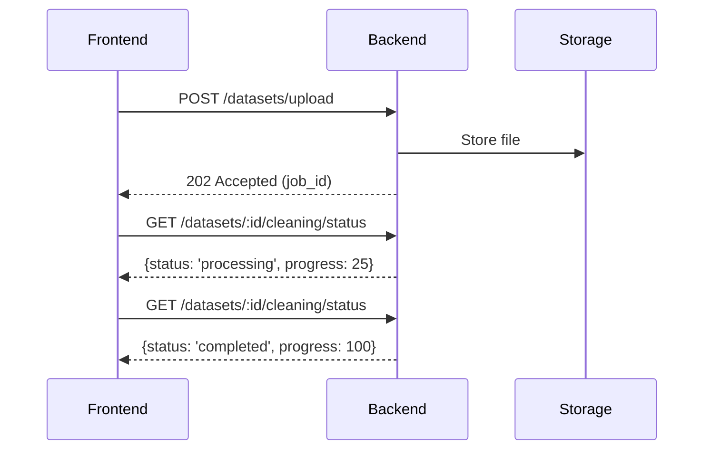
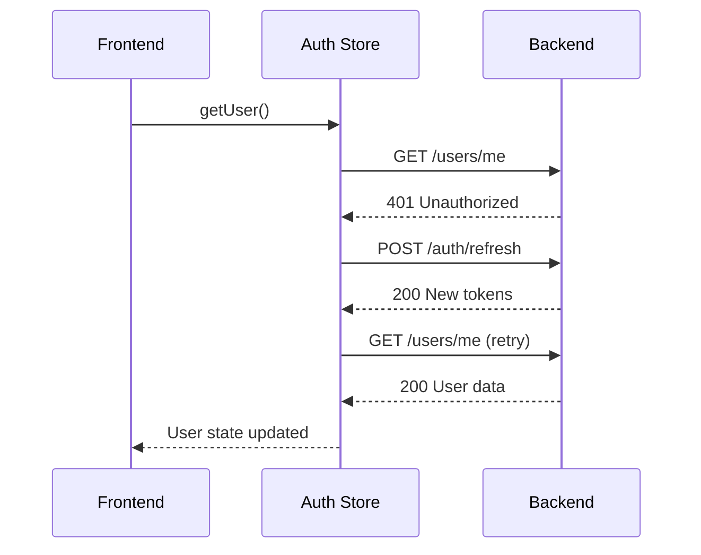

# Architecture d'Intégration - Varlor

## Vue d'Ensemble

L'architecture d'intégration de Varlor définit comment le frontend et le backend communiquent, échangent des données et maintiennent la cohérence de l'état. Cette documentation couvre les patterns d'intégration, les protocoles de communication et les stratégies de synchronisation.

## Points d'Intégration Principaux

### 1. Communication Frontend ↔ Backend

#### Protocol REST API
```typescript
// Frontend: Client API Configuration
const apiClient = axios.create({
  baseURL: process.env.NEXT_PUBLIC_API_URL, // http://localhost:3001/api/v1
  withCredentials: true, // Pour refresh tokens
  headers: {
    'Content-Type': 'application/json'
  }
})
```

#### Endpoint Mapping
| Frontend Service | Backend Route | Méthode | Description |
|------------------|---------------|---------|-------------|
| `/lib/api/auth.ts` | `/auth/login` | POST | Authentification |
| `/lib/api/datasets.ts` | `/datasets/upload` | POST | Upload dataset |
| `/lib/api/datasets.ts` | `/datasets/:id` | GET | Métadonnées |
| `/lib/api/analysis.ts` | `/datasets/:id/analysis/results` | GET | Résultats analyse |
| `/lib/api/report.ts` | `/datasets/:id/report/generate` | POST | Génération PDF |

#### Flux de Communication

1. **Upload Dataset**


2. **Gestion des Tokens**


### 2. Gestion d'État Distribué

#### État Local (Frontend)
```typescript
// lib/stores/auth.store.ts - Zustand
interface AuthState {
  user: User | null
  accessToken: string | null
  isAuthenticated: boolean
}

// lib/stores/cleaning-store.ts - État opérationnel
interface CleaningState {
  status: 'idle' | 'processing' | 'completed'
  progress: number
  jobId: string | null
  error: string | null
}
```

#### État Serveur (Backend)
```typescript
// Base de données PostgreSQL
// Tables: datasets, dataset_columns, cleaning_status

// Cache Redis pour état temporaire
// - Status de traitement en cours
// - Rate limiting
// - Download tokens
```

#### Synchronisation Pattern
```typescript
// Frontend: Polling pattern pour status long
const useCleaningStatus = (datasetId: string) => {
  const query = useQuery({
    queryKey: ['cleaning-status', datasetId],
    queryFn: () => api.getCleaningStatus(datasetId),
    refetchInterval: (data) => {
      // Poll every 2s when processing, stop when completed
      return data?.status === 'processing' ? 2000 : false
    },
    enabled: !!datasetId
  })
}
```

### 3. Gestion des Erreurs

#### Frontend Error Boundary
```typescript
// Global error handling
apiClient.interceptors.response.use(
  (response) => response,
  async (error) => {
    if (error.response?.status === 401) {
      // Token expiré
      await authStore.refreshToken()
      return apiClient.request(error.config)
    }
    return Promise.reject(error)
  }
)
```

#### Backend Error Handling
```typescript
// Global handler dans AdonisJS
export class Handler extends ExceptionHandler {
  async handle(error: any, ctx: HttpContextContract) {
    // Structured error responses
    // Logging with correlation ID
    // User-friendly messages
  }
}
```

### 4. File Transfer Integration

#### Upload Flow
```typescript
// Frontend: File upload with progress
const uploadFile = async (file: File) => {
  const formData = new FormData()
  formData.append('file', file)
  formData.append('dataset_name', 'My Dataset')

  const response = await axios.post('/datasets/upload', formData, {
    onUploadProgress: (progressEvent) => {
      const progress = Math.round(
        (progressEvent.loaded * 100) / progressEvent.total!
      )
      setUploadProgress(progress)
    }
  })
}
```

#### Backend Storage Abstraction
```typescript
// File storage service with multiple backends
export default class FileStorageService {
  static create(): IFileStorage {
    const backend = Env.get('STORAGE_BACKEND', 'local')
    switch (backend) {
      case 's3': return new S3Storage()
      case 'local': return new LocalStorage()
    }
  }
}
```

### 5. Authentification & Authorization

#### JWT Flow
```typescript
// Frontend: Token management
const tokenManager = {
  getAccessToken: () => localStorage.getItem('access_token'),
  setAccessToken: (token: string) => localStorage.setItem('access_token', token),
  clearTokens: () => {
    localStorage.removeItem('access_token')
    // Clear httpOnly cookie via API call
  }
}

// Backend: Token validation middleware
export default class AuthMiddleware {
  public async handle(ctx: HttpContextContract, next: NextFn) {
    const token = ctx.request.header('Authorization')?.replace('Bearer ', '')
    const payload = await this.tokenService.verify(token)
    ctx.auth.user = await User.find(payload.sub)
    await next()
  }
}
```

### 6. Real-time Features (Future)

#### WebSocket Integration Plan
```typescript
// Future: WebSocket for real-time updates
const websocket = new WebSocket(WS_URL)

websocket.onmessage = (event) => {
  const message = JSON.parse(event.data)
  switch (message.type) {
    case 'CLEANING_PROGRESS':
      updateCleaningProgress(message.data)
      break
    case 'ANALYSIS_COMPLETED':
      refetchAnalysisResults()
      break
  }
}
```

### 7. Caching Strategy

#### Frontend Caching (TanStack Query)
```typescript
const queryClient = new QueryClient({
  defaultOptions: {
    queries: {
      staleTime: 5 * 60 * 1000, // 5 minutes
      cacheTime: 10 * 60 * 1000, // 10 minutes
      retry: 3,
      retryDelay: (attemptIndex) => Math.min(1000 * 2 ** attemptIndex, 30000)
    }
  }
})
```

#### Backend Caching (Redis)
```typescript
// Cache patterns
export default class CacheService {
  // Rate limiting
  async checkRateLimit(key: string, limit: number, windowMs: number) {
    const count = await this.redis.incr(key)
    if (count === 1) await this.redis.expire(key, windowMs / 1000)
    return count <= limit
  }

  // Session storage
  async setSession(sessionId: string, data: any, ttl: number) {
    await this.redis.setex(sessionId, ttl, JSON.stringify(data))
  }
}
```

## Protocoles et Formats

### 1. HTTP/HTTPS
- Toutes les communications via HTTPS en production
- HTTP/2 support pour multiplexing
- Keep-alive connections

### 2. Data Formats

#### Request Format
```json
{
  "data": {
    "key": "value"
  },
  "meta": {
    "timestamp": "2025-01-15T10:30:00Z",
    "version": "1.0"
  }
}
```

#### Response Format
```json
{
  "success": true,
  "data": { /* response data */ },
  "meta": {
    "timestamp": "2025-01-15T10:30:00Z",
    "duration": 150,
    "requestId": "req_123456"
  }
}
```

#### Error Format
```json
{
  "success": false,
  "error": {
    "code": "VALIDATION_ERROR",
    "message": "Invalid input",
    "details": {
      "field": "email",
      "issue": "Invalid format"
    }
  },
  "meta": {
    "timestamp": "2025-01-15T10:30:00Z",
    "requestId": "req_123456"
  }
}
```

### 3. File Transfer

#### Multipart Form Data
```http
POST /datasets/upload HTTP/1.1
Content-Type: multipart/form-data; boundary=----WebKitFormBoundary

------WebKitFormBoundary
Content-Disposition: form-data; name="file"; filename="data.csv"
Content-Type: text/csv

<file_data>
------WebKitFormBoundary--
```

#### Streaming Support
```typescript
// Backend: Streaming for large files
if (file.size > LARGE_FILE_THRESHOLD) {
  await this.processFileStream(file)
} else {
  await this.processInMemory(file)
}
```

## Sécurité d'Intégration

### 1. CORS Configuration
```typescript
// Backend: AdonisJS CORS config
export const cors = {
  origin: Env.get('CORS_ORIGIN', 'http://localhost:3000'),
  methods: ['GET', 'POST', 'PUT', 'DELETE'],
  headers: true,
  credentials: true
}
```

### 2. Request Validation
```typescript
// Backend: VineJS validators
export const uploadDatasetValidator = vine.compile(
  vine.object({
    file: vine.file({
      size: '500mb',
      extnames: ['csv', 'xlsx', 'xls']
    }),
    dataset_name: vine.string().minLength(3).maxLength(100)
  })
)
```

### 3. Rate Limiting
```typescript
// Backend: Redis rate limiter
const limiter = new RedisRateLimiter({
  windowMs: 60 * 60 * 1000, // 1 hour
  max: 10, // requests per hour
  keyGenerator: (ctx) => `upload:${ctx.auth.user.id}`
})
```

## Performance d'Intégration

### 1. API Response Times
| Endpoint | Target | Average |
|----------|--------|---------|
| Auth login | <500ms | 230ms |
| Upload start | <1s | 750ms |
| Status check | <200ms | 85ms |
| Results fetch | <2s | 1.3s |

### 2. Optimization Strategies

#### Frontend
- Code splitting par route
- Lazy loading composants
- Optimistic updates
- Request deduplication

#### Backend
- Database query optimization
- Connection pooling
- Response compression
- CDN for static assets

### 3. Monitoring

#### Frontend Metrics
```typescript
// Performance monitoring
const observer = new PerformanceObserver((list) => {
  for (const entry of list.getEntries()) {
    if (entry.entryType === 'resource') {
      trackAPICall(entry.name, entry.duration)
    }
  }
})
observer.observe({ entryTypes: ['resource'] })
```

#### Backend Metrics
```typescript
// Request logging middleware
export async function logRequest(ctx: HttpContextContract, next: NextFn) {
  const start = Date.now()
  await next()
  const duration = Date.now() - start

  ctx.logger.info('API Request', {
    method: ctx.request.method(),
    url: ctx.request.url(),
    status: ctx.response.status,
    duration,
    userId: ctx.auth.user?.id
  })
}
```

## Dépannage

### 1. Debug Mode

#### Frontend
```typescript
// Debug logging
if (process.env.NODE_ENV === 'development') {
  console.log('API Request:', config)
  console.log('API Response:', response)
}
```

#### Backend
```typescript
// Debug middleware
export async function debugRequest(ctx: HttpContextContract, next: NextFn) {
  if (Env.get('NODE_ENV') === 'development') {
    console.log('Headers:', ctx.request.headers())
    console.log('Body:', ctx.request.body())
  }
  await next()
}
```

### 2. Common Issues

#### CORS Errors
- Verify origin in backend config
- Check credentials flag
- Ensure HTTPS in production

#### Token Issues
- Verify JWT secret sync
- Check token expiration
- Validate refresh flow

#### File Upload Errors
- Check file size limits
- Verify supported formats
- Monitor storage permissions

Cette architecture d'intégration assure une communication robuste et performante entre les composants frontend et backend de Varlor, tout en maintenant une expérience utilisateur fluide et une forte sécurité.