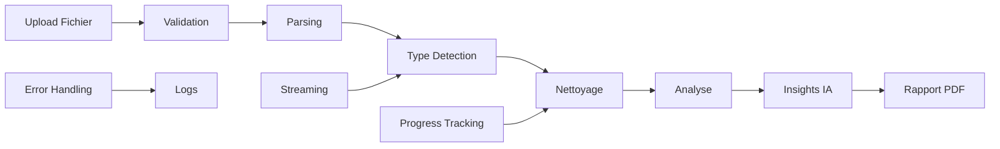

# Vue d'Ensemble - Varlor

## Résumé du Projet

Varlor est une plateforme de **data intelligence** souveraine et universelle conçue pour aider les entreprises à prendre le contrôle total de leurs données. Elle permet d'importer, nettoyer, analyser et générer des rapports intelligents à partir de n'importe quelle source de données.

## Vision Stratégique

### Objectif Principal
**Se brancher partout. Comprendre tout. S'adapter à n'importe quel client.**

Varlor vise à devenir une alternative européenne moderne à des solutions comme Palantir Foundry, en offrant :
- **Ingestion universelle** : Tous formats, toutes sources
- **Nettoyage automatique** : Qualité données sans effort
- **Analyse avancée** : Statistiques + IA
- **Rapports intelligents** : PDF avec insights
- **Déploiement souverain** : On-premise, air-gapped

### Marché Cible
- PME, ETI, grands comptes français et européens
- Secteurs avec données sensibles (santé, finance, industrie)
- Organisations nécessitant souveraineté numérique

## Architecture Technique

### Type de Dépôt
- **Multi-part** : Frontend et backend séparés
- **Monorepo** : Structure unifiée avec Git submodules

### Parties du Projet

#### 1. Frontend Web (client/web)
- **Type** : Application web React
- **Technologie** : Next.js 16 + React 19
- **Rôle** : Interface utilisateur pour gestion et visualisation
- **Fonctionnalités** :
  - Upload de fichiers (CSV, Excel)
  - Interface de nettoyage
  - Tableaux de bord d'analyse
  - Génération de rapports PDF
  - Visualisations interactives

#### 2. Backend API (server)
- **Type** : API RESTful
- **Technologie** : AdonisJS 6 + Node.js
- **Rôle** : Traitement des données et logique métier
- **Fonctionnalités** :
  - Parsing et validation fichiers
  - Nettoyage automatique
  - Analyse statistique
  - Génération insights IA
  - Stockage sécurisé

## Stack Technologique

### Frontend
| Catégorie | Technologie | Version |
|-----------|-------------|---------|
| Framework | Next.js | 16.0.3 |
| UI Library | React | 19.2.0 |
| Language | TypeScript | 5.7.2 |
| Styling | Tailwind CSS | 4.1.0 |
| State Management | Zustand | 5.0.8 |
| Server State | TanStack Query | 5.90.10 |
| Forms | React Hook Form | 7.66.1 |
| Validation | Zod | 4.1.12 |
| Components | Shadcn/ui | Custom |
| Charts | Apache ECharts | 6.0.0 |

### Backend
| Catégorie | Technologie | Version |
|-----------|-------------|---------|
| Framework | AdonisJS | 6.18.0 |
| Runtime | Node.js | LTS |
| Language | TypeScript | 5.8 |
| Database | PostgreSQL | 14+ |
| ORM | Lucid ORM | 21.6.1 |
| Cache | Redis | 7+ |
| Validation | VineJS | 3.0.1 |
| PDF Generation | Puppeteer | 24.31.0 |
| CSV Parsing | PapaParse | 5.5.3 |
| Excel Parsing | ExcelJS | 4.4.0 |

## Fonctionnalités Clés

### 1. Import Universel
- **Formats supportés** : CSV, Excel (xlsx, xls)
- **Taille maximale** : 500MB
- **Encoding auto-détection** : UTF-8, ISO-8859-1, etc.
- **Validation structurelle** : Détection automatique des types

### 2. Nettoyage Intelligent
- **Détection automatique** :
  - Valeurs manquantes
  - Formats invalides
  - Valeurs aberrantes
  - Doublons
  - Incohérences
- **Corrections appliquées** :
  - Normalisation dates
  - Correction nombres
  - Trim texte
  - Standardisation formats

### 3. Analyse Statistique
- **Statistiques descriptives** :
  - Min, Max, Moyenne, Médiane
  - Écart-type, Variance
  - Quartiles, Percentiles
- **Détection outliers** : Méthode IQR
- **Visualisations** :
  - Histogrammes
  - Diagrammes en barres
  - Courbes temporelles
  - Nuages de points

### 4. Insights IA
- **Génération automatique** d'analyses textuelles
- **Interprétation des statistiques**
- **Suggestions de visualisations**
- **Détection de patterns**

### 5. Rapports PDF
- **Structure complète** :
  - Résumé dataset
  - Métriques qualité
  - Analyses par colonne
  - Visualisations
  - Insights IA
- **Branding personnalisable**
- **Téléchargement sécurisé**

## Sécurité et Souveraineté

### Authentification
- JWT avec refresh tokens
- Rotation automatique des tokens
- Mots de passe hashés (scrypt)
- Rate limiting login

### Isolation Données
- Multi-tenancy par `tenant_id`
- Isolation stricte utilisateurs
- Vérification ownership

### Déploiement
- **On-premise** possible
- **Air-gapped** supporté
- **Cloud privé** compatible
- **Données jamais sorties** de l'entreprise

## Pipeline de Traitement



## Performance

### Scalabilité
- **Streaming** pour fichiers >50MB
- **Background jobs** pour traitements longs
- **Cache Redis** pour status rapid access
- **Pagination** résultats

### Optimisations
- **Database indexes** optimisés
- **JSONB storage** flexibilité
- **Composite queries** réduction appels
- **ETag caching** réponses immuables

## Développement

### Environnement Local
```bash
# Backend
cd server
npm install
cp .env.example .env
node ace migration:run
npm run dev  # Port 3001

# Frontend
cd client/web
npm install
cp .env.example .env.local
npm run dev  # Port 3000
```

### Tests
- **Frontend** : Jest + React Testing Library + Playwright
- **Backend** : Japa avec API client intégré
- **Couverture** : 30+ tests E2E workflows complets

## Roadmap

### MVP (Actuel)
- ✅ Upload/Cleaning/Analysis
- ✅ Authentification sécurisée
- ✅ Rapports PDF
- ✅ UI/UX moderne

### Alpha/Beta (Prochain)
- 🔄 Connecteurs API/DB
- 🔄 Dashboard admin
- 🔄 Export multi-formats
- 🔄 API publique

### V1 Enterprise
- ⏳ Déploiement multi-tenant
- ⏳ Audit logging
- ⏳ SSO entreprise
- ⏳ Support SLA

### V2 Platform
- ⏳ Workflow designer
- ⏳ Machine learning
- ⏳ API marketplace
- ⏳ Edge deployment

## Équipe et Contribution

### Rôles
- **Developers** : Full-stack TypeScript
- **Data Scientists** : Algorithmes analyse
- **DevOps** : Infrastructure CI/CD
- **Security** : Audit et conformité

### Standards
- **Code Style** : ESLint + Prettier
- **Git Flow** : Feature branches + PRs
- **Documentation** : Auto-générée + résumés
- **Tests** : TDD pour nouvelles features

## Conclusion

Varlor représente une approche moderne et souveraine de la data intelligence, combinant les meilleures pratiques du développement logiciel avec une compréhension profonde des besoins des entreprises européennes. Son architecture modulaire et sa stack technologique de pointe assurent une base solide pour l'évolution vers une plateforme enterprise-ready.