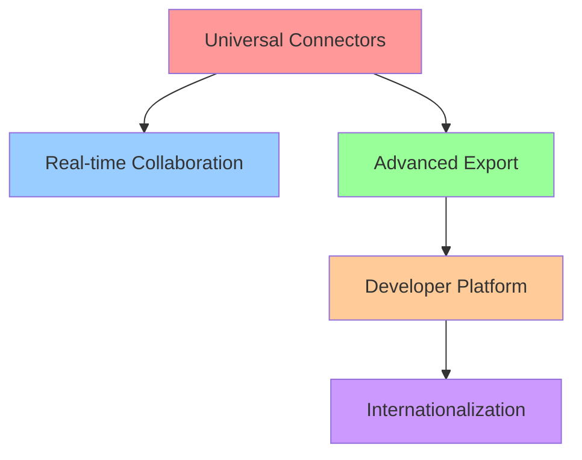

# Varlor Alpha Phase - Sprint Plan

**Author:** Hugo (Scrum Master)
**Date:** 2025-12-06
**Phase:** Alpha (12 weeks)
**Team:** Varlor Development Team
**Document Version:** 1.0

---

## Executive Summary

This sprint plan outlines the 12-week Alpha phase execution for Varlor, focusing on delivering 5 critical epics that will transform the MVP into a comprehensive data collaboration platform. The Alpha phase prioritizes universal data connectors as the foundational epic that enables subsequent features.

**Key Highlights:**
- 12-week sprint cycle starting January 6, 2025
- 5 epics with 29 user stories to deliver
- Parallel track approach with staggered start times
- Focus on enterprise-ready features and European market requirements

---

## Sprint Schedule & Timeline

### Phase Overview
- **Start Date:** January 6, 2025
- **End Date:** March 30, 2025
- **Total Duration:** 12 weeks
- **Sprint Length:** 2 weeks
- **Total Sprints:** 6

### Sprint Calendar

| Sprint | Dates | Focus | Key Deliverables |
|--------|-------|-------|------------------|
| Sprint 0 | Jan 6-19 | Setup & Epic 1 Kickoff | Epic 1 Context, Dev Environment |
| Sprint 1 | Jan 20-Feb 2 | Epic 1 Core Features | Database/API connectors |
| Sprint 2 | Feb 3-16 | Epic 1 Completion + Epic 2 Start | Storage connectors, WebSocket infra |
| Sprint 3 | Feb 17-Mar 2 | Epic 2 Real-time Features | Collaborative editing, comments |
| Sprint 4 | Mar 3-16 | Epic 2 + Epic 3 | Version control, Export system |
| Sprint 5 | Mar 17-30 | Epic 3 + Epic 4 | Advanced exports, API platform |
| Sprint 6 | Mar 31-Apr 13 | Epic 4 + Epic 5 | SDKs, Internationalization |

### Epic Dependencies Map

---

## Team Structure & Resources

### Core Team Roles

| Role | Person | Allocation | Responsibilities |
|------|--------|------------|------------------|
| Scrum Master | Hugo | 100% | Sprint planning, backlog management, coordination |
| Senior Backend Dev | TBD | 100% | API development, connector implementation |
| Senior Frontend Dev | TBD | 100% | React components, real-time features |
| Full-stack Dev | TBD | 100% | Cross-cutting features, SDK development |
| DevOps Engineer | TBD | 50% | Infrastructure, deployment, monitoring |
| QA Engineer | TBD | 75% | Testing, automation, quality assurance |
| UX Designer | TBD | 50% | UI/UX design, user feedback |
| Product Owner | TBD | 50% | Requirements, priorities, stakeholder mgmt |

### Team Capacity Planning

**Total Story Points per Sprint:** 40
**Available Developer Days:** 30 days (excluding holidays)
**Velocity Target:** 35-45 story points per sprint

### External Resources

- **Technical Advisor:** Database architecture consultation
- **Security Consultant:** GDPR and enterprise security review
- **Localization Partner:** Translation services for French/English

---

## Epic Details & Allocation

### Epic 1: Universal Data Connectors (Weeks 1-4)
**Priority:** CRITICAL - Enables all other features
**Allocation:** 60% of team capacity
**Definition of Done:**
- All connector types implemented and tested
- Sync scheduling working reliably
- Monitoring dashboard operational
- Documentation complete
- Security review passed

**Stories by Sprint:**
- Sprint 0-1: Stories 1.1-1.2 (Database & API connectors)
- Sprint 2: Stories 1.3-1.4 (Storage & Scheduling)
- Sprint 3: Stories 1.5-1.6 (Incremental sync & Monitoring)

### Epic 2: Real-time Collaboration (Weeks 3-6)
**Priority:** HIGH - Key differentiator
**Allocation:** 40% of team capacity (parallel with Epic 1 completion)
**Definition of Done:**
- WebSocket infrastructure scaled for 1000+ users
- Conflict-free editing implemented
- Comment system working
- Version control functional
- Performance benchmarks met

### Epic 3: Advanced Export System (Weeks 5-8)
**Priority:** MEDIUM - Enterprise requirement
**Allocation:** 60% of team capacity
**Definition of Done:**
- All export formats supported
- Template system operational
- Scheduling working
- Webhooks implemented
- Security measures in place

### Epic 4: Developer Platform (Weeks 7-10)
**Priority:** HIGH - Ecosystem enabler
**Allocation:** 40% of team capacity
**Definition of Done:**
- REST API v2 complete
- GraphQL endpoints functional
- SDKs published
- Documentation comprehensive
- Sandbox environment stable

### Epic 5: Internationalization (Weeks 9-12)
**Priority:** MEDIUM - Market expansion
**Allocation:** 40% of team capacity
**Definition of Done:**
- French & English fully supported
- Dynamic language switching
- Regional formats working
- AI insights translated
- User acceptance testing passed

---

## Risk Assessment & Mitigation

### High-Risk Items

| Risk | Impact | Probability | Mitigation Strategy |
|------|--------|------------|-------------------|
| Epic 1 complexity underestimated | High | Medium | Start with PoC, buffer time allocated |
| Real-time performance issues | High | Medium | Load testing from Sprint 2 |
| Third-party connector limitations | Medium | High | Implement fallback strategies |
| Team availability | High | Low | Cross-training, documentation |
| Security vulnerabilities | High | Low | Regular audits, expert review |

### Contingency Planning

**Buffer Allocation:** 20% of each sprint capacity reserved for:
- Unexpected complexity
- Bug fixes from previous sprints
- Technical debt reduction
- Emergent requirements

**Escape Velocity:** If sprint velocity < 80% of target for 2 consecutive sprints:
- Re-evaluate epic priorities
- Consider descope of non-critical features
- Additional resource allocation

---

## Definition of Done (DoD)

### Epic Completion Criteria
1. **Functional Requirements:** All acceptance criteria met
2. **Technical Requirements:** Code reviewed, merged, deployed
3. **Quality Requirements:** 90%+ test coverage, performance benchmarks met
4. **Documentation:** User docs, API docs, technical docs complete
5. **Security:** Security review passed, penetration test done
6. **Compliance:** GDPR requirements satisfied

### Story Completion Criteria
1. **Code:** Peer-reviewed, merged to main branch
2. **Testing:** Unit tests, integration tests, E2E tests passing
3. **Documentation:** README updated, code comments adequate
4. **Deployment:** Deployed to staging, tested by QA
5. **Acceptance:** PO approval, stakeholder demonstration

---

## Success Metrics

### Technical Metrics
- **API Response Time:** <200ms (95th percentile)
- **WebSocket Latency:** <50ms for real-time features
- **Concurrent Users:** 1000+ supported
- **Uptime:** 99.9% availability
- **Test Coverage:** >90% for new code

### Business Metrics
- **Connector Adoption:** 10+ connectors implemented
- **User Engagement:** 50%+ users collaborate on datasets
- **Export Usage:** 1000+ exports/week
- **API Adoption:** 20+ external integrations
- **International Usage:** 30% non-English users

### Sprint Metrics
- **Velocity:** Consistent 35-45 story points
- **Burndown:** Predictable completion rate
- **Quality:** <5 bugs per sprint
- **Team Satisfaction:** >4/5 team satisfaction score

---

## Communication & Reporting

### Daily Standups
- **Time:** 9:00 AM CET
- **Duration:** 15 minutes
- **Participants:** All team members
- **Format:** Yesterday, Today, Blockers

### Sprint Reviews
- **When:** Last day of sprint
- **Participants:** Team, PO, stakeholders
- **Agenda:** Demo, metrics, feedback, retro planning

### Sprint Retrospectives
- **When:** First day of next sprint
- **Duration:** 2 hours
- **Format:** What went well, what didn't, improvements

### Stakeholder Updates
- **Weekly:** Email summary with progress
- **Bi-weekly:** Demo sessions with leadership
- **Monthly:** Business metrics review

---

## Tools & Infrastructure

### Development Tools
- **Version Control:** Git + GitHub
- **Project Management:** GitHub Projects
- **CI/CD:** GitHub Actions
- **Code Quality:** SonarQube, ESLint
- **Testing:** Jest, Cypress, Playwright

### Monitoring & Analytics
- **APM:** Datadog or New Relic
- **Error Tracking:** Sentry
- **Logs:** ELK Stack
- **Metrics:** Prometheus + Grafana
- **Analytics:** PostHog or Amplitude

### Documentation
- **Technical:** Confluence
- **API:** Swagger/OpenAPI
- **User:** GitBook
- **Code:** Inline comments, READMEs

---

## Budget Considerations

### Development Costs
- **Team Salaries:** 8 FTEs × 12 weeks
- **Cloud Infrastructure:** $5,000/month
- **Third-party Services:** $2,000/month
- **Tools & Licenses:** $1,000/month

### Additional Costs
- **Security Audit:** $15,000
- **Translation Services:** $10,000
- **Compliance Consulting:** $8,000
- **Performance Testing:** $5,000

---

## Next Steps & Immediate Actions

### This Week (Sprint 0)
1. [ ] Finalize team assignments and contracts
2. [ ] Set up development environments
3. [ ] Create Epic 1 technical context document
4. [ ] Establish CI/CD pipelines
5. [ ] Begin Story 1.1 implementation

### Week 2
1. [ ] Complete Epic 1 technical specifications
2. [ ] Start database connector implementation
3. [ ] Set up monitoring infrastructure
4. [ ] Conduct security architecture review

### Month 1 Goals
1. [ ] Epic 1 stories 1.1-1.2 completed
2. [ ] Infrastructure scaled for production
3. [ ] Initial customer feedback on connectors
4. [ ] Team velocity established

---

## Appendix

### Epic Dependencies Detail
- Epic 1 must be 50% complete before Epic 2 can start (needs live data)
- Epic 3 can start once Epic 1 basic connectors are working
- Epic 4 requires stable API from Epic 1
- Epic 5 is independent but saves time with Epic 4 components

### Critical Path
1. Database connectors (2 weeks)
2. WebSocket infrastructure (1 week)
3. Real-time editing (2 weeks)
4. Export system (2 weeks)
5. API platform (2 weeks)

### Resource Constraints
- Frontend developer critical path: Epic 2 → Epic 3 → Epic 5
- Backend developer can work in parallel on multiple epics
- DevOps capacity limited to 50% - prioritize automation

---

*Last Updated: 2025-12-06*
*Next Review: End of Sprint 0 (2025-01-19)*